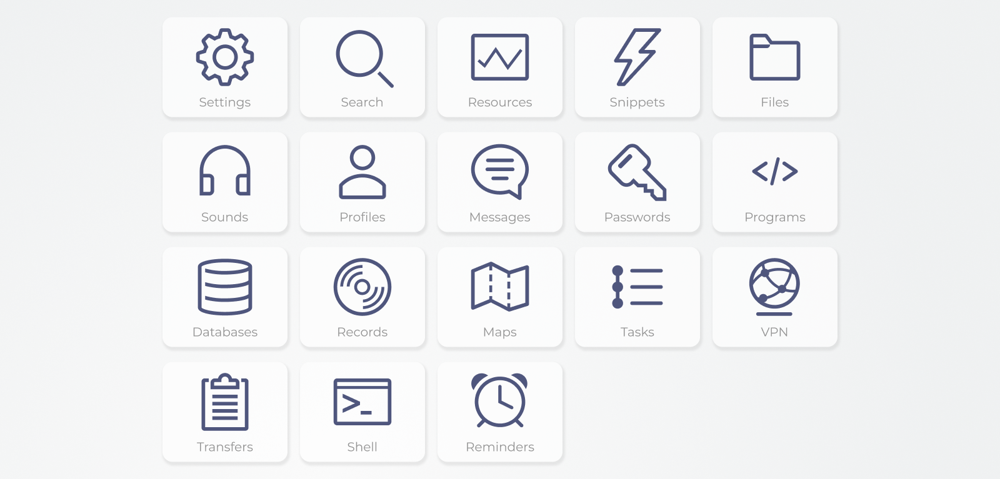

# NAS

A NAS server with additional plugins.

___

Hi, hi! Welcome on this ambitious project!

The project idea is to have a **portable server** (and router) where you can store **musics, videos, documents *etc...*** and that you can **bring with you** wherever you go on whatever mean of transport (don't watch videos while driving though), that you can connect to from all your devices to **stream, share, work, log, or search in your docs without connecting to Internet**.

The goal? **Avoid streaming again and again** the same musics (or videos) from across the world and beyond (satellites), **connect all your devices** together without handing your private life to Internet on a silver plate, or view the local map or record your journey in a deep forest, a desert, underwater or in the sky!

The cost? I don't know the minimum configuration yet, but it should be able to run on a 1GB (RAM) Raspberry. That is all you need to take the hand back on your devices.

**Expand your network to an ecosystem now!**

## 🎯 Latest version

>   Version number: 26.1.12 \
    Date: 2026-07-20

### 📝 Release notes

Patch a few issues with the documentation of configuration files:

* Indented documentation is now recognized;
* The Settings interface now displays description and references for configuration groups;
* Properties named "name" will not overwrite their parent's display name and cause error anymore;
* Inline YAML mappings are now correctly parsed (but don't do that).

In addition, references in documentation (external links specified with the `@docs` token) can specify a custom text to display (CTA).

To read more about the documentation syntax, read the [syntax reference for documenting configuration](doc/reference/yaml-syntax-for-plugin-configuration.md#configuration-documentation).

Some configuration files were modified too.

### 📅 Planned releases

| Number  | Features                    |
| ------- | --------------------------- |
| 26.2.0  | The Settings plugin         |
| 26.3.0  | The Files (cloud) plugin    |
| 26.4.0  | Tests                       |
| 26.5.0  | Changelogs                  |
| 26.10.0 | Full documentation          |

___

## 🚩 Installation and configuration

### 🖥️ Hardware requirements

I don't know the minimum configuration yet, but I personally use a 1GB (RAM) Raspberry Pi 4 B for my own, so:

| Requirement | Minimum                | Recommanded           |
| ----------: | :--------------------: | :-------------------: |
| OS          | Anything that runs PHP | Raspberry Pi OS       |
| CPU         | ?                      | Quad core Cortex-A72  |
| RAM         | ?                      | 1 GB                  |
| Storage     | 4 GB                   | 64 GB (musics, videos)|
| Wi-Fi       | ?                      | 2.4 GHz / Ethernet    |

### 📦 Installation

*To be determined.*

## 🔌 Plugins showcase

Plugins are services that can be enabled (or disabled) depending on your needs and your resources. They add new powerful and tailored tools in addition to the main functionality of serving files.

> Notes: The plugins are presented here for illustrative purposes and are subject to change during development.

### 🔩 Core plugins

These plugins can not be disabled. At this point, just uninstall the program... The program doesn't do anything without any other plugin.

* **Shell** - The command line interface of the server.
* **Settings** - The configuration center of the core program and every other plugins.

### 🛞 Native plugins

These plugins are enabled by default as they may be useful for the majority of users, but can easily be disabled if needed.

* **Files** - A storage for your medias and documents to share across devices or for your backups.
* **Interface** - A graphical user interface (for browsers).
* **Resources** - A monitoring center for resources usage and statistics.
* **Search** - A powerful search bar to find everything on your server.
* **Network** - A Wi-Fi network (proxy) you can connect to with your devices. Can be used as a DNS server, a network-wide advertising blocker, or your personal VPN.
* **Snippets** - "Everything can be simplified". Easy shortcuts to automate your daily tasks (may not do the housework).

### 🔗 Additional plugins

These plugins may not be suited for everyone's use but will surely find their fans.

* **Profiles** - Separates the files and behaviors depending on who is connected (accounts).
* **Messages** - A all-in-one inbox for all your messages.
* **Passwords** - A credential manager.
* **Projects** - Developer tools to host, deploy, test and backup all projects.

## 📚 Enabling / disabling a plugin

*To be determined.*

## 📖 Creating a plugin

As it stands, a plugin can be defined in 3 independent and optional ways:

### 1. The controller

Every PHP file in the directory `web-server/src/Plugin/` will be considered as a plugin by the `PluginList` service (namespace `App\Service\FileList`) and returned by the `PluginList::get_config_list` method and the `/api/plugins/list` endpoint.

Currently, the endpoint is completely unused and the `PluginList::get_config_list` method is only used by the endpoint.

> **Imminent change:** The plugins returned by this method correspond to the lowercase filenames without the extension and might differ from the actual plugin ids, *e.g.* the Interface plugin's controller is named "WebInterface" but its id is "interface".

Plugins can (and should) be used as [Symfony services](https://symfony.com/doc/current/service_container.html) so that you don't need to construct them yourself, instead the framework autowires them whenever you define them in a function's parameters.

Additionally, you can use a [`Route` attribute](https://symfony.com/doc/current/routing.html#creating-routes-as-attributes) on a plugin function to automatically call this function whenever the user tries to reach the specified endpoint.

The plugins that inherit from the `BasePlugin` class (namespace `App\Plugin`) can access the `BasePlugin::config` shorthand to read or write a plugin setting. See the [walkthrough about configuring a plugin](doc/guides/configure-a-plugin.md) for more details.

> Note that to inherit from `BasePlugin`, a plugin **must pass the `ConfigList` service** to the constructor, even if this plugin doesn't access any configuration file.

### 2. The interface

Every folder in the directory `web-server/templates/` that contains a file named `main.html.twig` will be considered as a plugin by the `WebInterface` plugin.

Such template can be accessed at `/<folder name>`.

> Note that it is recommended to name the folder like the plugin id else the template could become unavailable in a future release.

### 3. The configuration

*You may want to read the [walkthrough about configuring a plugin](doc/guides/configure-a-plugin.md).*

Every YAML file or subfolder in the directory `config/plugins/` will be considered as a plugin by the `ConfigList` service (namespace `App\Service\FileList`). Both a YAML file and a subfolder can exist with the same name simultaneously.

Even if the `BasePlugin::config` shorthand only gives access to the configuration file or subfolder matching the calling plugin id, any plugin or any controller can call the `ConfigList::get` method and access any configuration file or subfolder, so there is no restriction for a plugin to have its configuration at a specific location, as long as it is located within the root-level `config/` directory.

## 🤝 Contributing

[Creating a plugin](#-creating-a-plugin) is already a huge contribution, but if you are interested in taking an active part in the project, contact me first (see [Contacts](#-contacts)) and I will be happy to give you all necessary access to the project.

If you want to report an issue or make a suggestion, you are more than welcome to use the GitHub Issues section of the project.

Finally, if you prefer suggesting your own idea of the project, feel free to fork the repository and edit my work as you wish.

## 📨 Contacts

If you want, you can contact me at santfals@gmail.com.